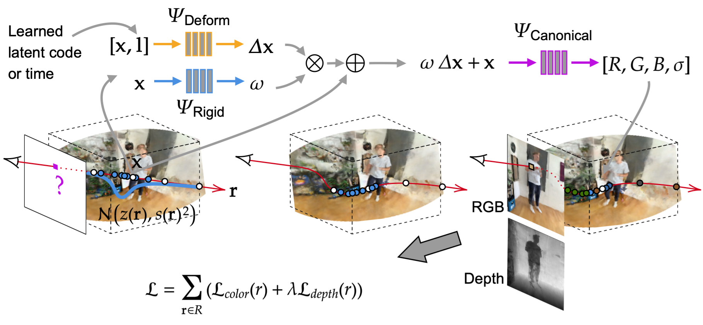

# DGD-NeRF: Depth-Guided Neural Radiance Fields for Dynamic Scenes
### [[Website]](ourwebsite) [[Paper]](ourpaper) 

DGD-NeRF is a method for synthesizing novel views, at an arbitrary point in time, of dynamic scenes with complex non-rigid geometries. We optimize an underlying deformable volumetric function from a sparse set of input monocular views without the need of ground-truth geometry nor multi-view images.

This project is an extension of [D-NeRF](https://github.com/albertpumarola/D-NeRF) improving modelling of dynamic scenes. We thank the authors of [NeRF-pytorch](https://github.com/yenchenlin/nerf-pytorch), [Dense Depth Priors for NeRF](https://github.com/barbararoessle/dense_depth_priors_nerf) and [Non-Rigid NeRF](https://github.com/facebookresearch/nonrigid_nerf) from whom be borrow code. 



## Installation
```
git clone https://github.com/philippwulff/D-NeRF.git
cd D-NeRF
conda create -n dgdnerf python=3.7
conda activate dgdnerf
pip install -r requirements.txt
```

If you want to directly explore the models or use our training data, you can download pre-trained models and the data:

**Download Pre-trained Weights**. You can download the pre-trained models from [drive](https://drive.google.com/file/d/1VN-_DkRLL1khDVScQJEaohpbA2gC2I2K/view?usp=sharing) or [dropbox](https://www.dropbox.com/s/25sveotbx2x7wap/logs.zip?dl=0). Unzip the downloaded data to the project root dir in order to test it later. This is what the directory structure looks like:
```
├── logs 
│   ├── human
│   ├── johannes 
│   ├── ...
```

*Download Datasets*
**DeepDeform**. This is a RGB-D dataset of dynamic scenes with fixed camera poses. You can request access on the project's [GitHub page](https://github.com/AljazBozic/DeepDeform).
**Own Data**. Download from [here](https://drive.google.com/drive/folders/1hUv1UZfxtmqVtushTH2_obexMv7mVu8L?usp=sharing).

## How to Use It

If you have downloaded the pre-trained, you can test models without training them. Otherwise, download our or you own data to train a model.

### Demo
You can use these jupyter notebooks to explore the model.

| Description      | Jupyter Notebook |
| ----------- | ----------- |
| Synthesize novel views at an arbitrary point in time. (Requires trained model) | render.ipynb|
| Reconstruct the mesh at an arbitrary point in time. (Requires trained model) | reconstruct.ipynb|
| Quantitatively evaluate trained models. | metrics.ipynb|
| See the camera trajectory of the training frames or novel views. | eda_virtual_camera.ipynb|
| Visualize the sampling along camera rays. (Requires training logs) | eda_ray_sampling.ipynb|

### Train
First download the dataset. Then,
```
conda activate dnerf
export PYTHONPATH='path/to/D-NeRF'
export CUDA_VISIBLE_DEVICES=0
python run_dnerf.py --config configs/mutant.txt
```

### Test
First download pre-trained weights and dataset. Then, 
```
python run_dnerf.py --config configs/johannes.txt --render_only --render_test
```
This command will run the `johannes` experiment. When finished, results are saved to `./logs/johannes/renderonly_test_799999`. To quantitatively evaluate model run the `metrics.ipynb` notebook.
